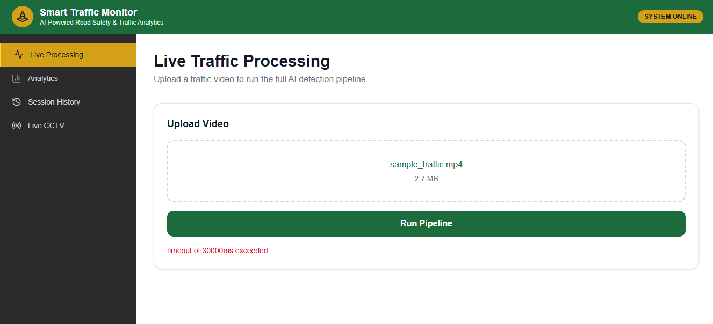
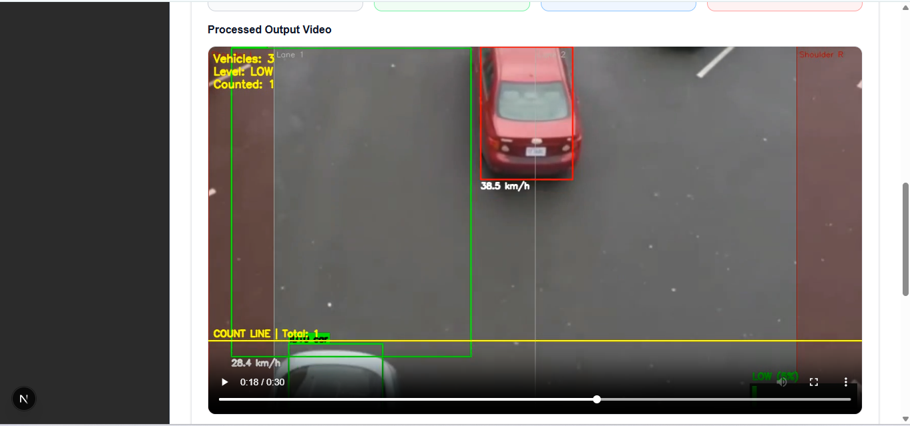
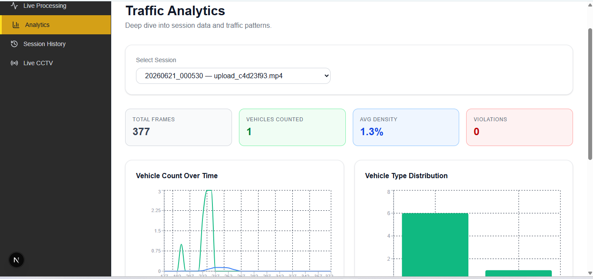
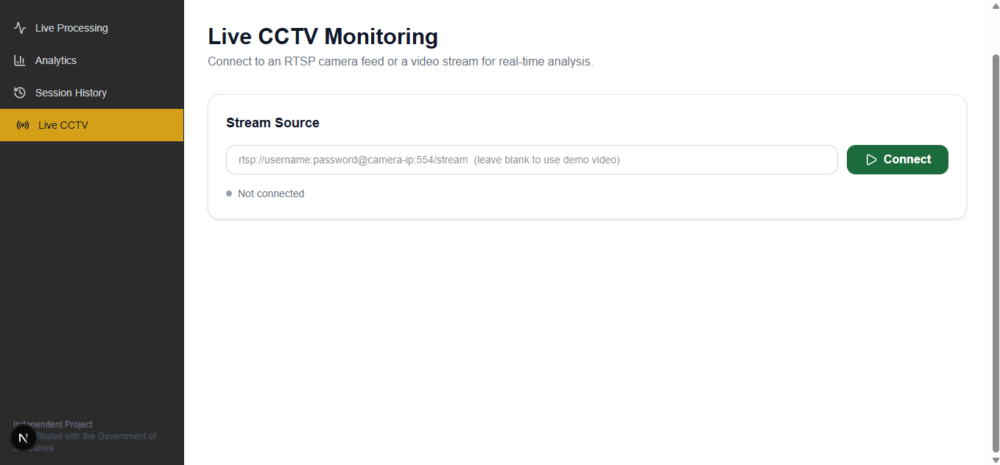

#  Smart Traffic Monitor

**AI-Powered Real-Time Traffic Monitoring & Road Safety Analytics System**

[](https://www.python.org/)
[](https://github.com/ultralytics/ultralytics)
[](https://nextjs.org/)
[](https://fastapi.tiangolo.com/)
[]()

A full-stack computer vision system that detects, tracks, counts, and analyzes vehicles in real time — from uploaded video or live CCTV/RTSP streams — with a government-style analytics dashboard.

---

##  Demo

[](https://youtube.com/watch?v=YOUR_VIDEO_ID)

**[▶ Watch the full demo video](https://youtu.be/9zW8uPmHUDk)**

---

## ✨ Features

- **Vehicle Detection** — YOLOv8 detects cars, trucks, buses, and motorcycles in real time
- **Multi-Object Tracking** — DeepSORT assigns persistent IDs across frames
- **Vehicle Counting** — Line-crossing logic with direction tracking
- **Speed Estimation** — Pixel-to-real-world speed calculation (km/h)
- **Traffic Density Analysis** — Live congestion scoring (Low/Moderate/High/Congested)
- **Lane Violation Detection** — Rule-based virtual zone monitoring
- **Traffic Heatmaps** — Visual accumulation of vehicle movement patterns
- **Live CCTV/RTSP Streaming** — Connects directly to IP cameras via WebSocket
- **Full Analytics Dashboard** — Session history, charts, and per-vehicle records
- **SQLite Persistence** — Every session, vehicle, and violation logged to a database

---

## 🏗️ Architecture

┌─────────────┐      ┌──────────────┐      ┌─────────────────┐

│  Next.js     │ ───▶ │  FastAPI      │ ───▶ │  CV Pipeline     │

│  Dashboard   │ ◀─── │  Backend      │ ◀─── │  YOLOv8+DeepSORT │

└─────────────┘  WS  └──────────────┘      └─────────────────┘

│

▼

┌─────────────┐

│   SQLite     │

└─────────────┘


---

## 🛠️ Tech Stack

| Layer | Technology |
|---|---|
| Detection | YOLOv8 (Ultralytics) |
| Tracking | DeepSORT |
| Backend | FastAPI, Python 3.11 |
| Frontend | Next.js 16, TypeScript, Tailwind CSS |
| Database | SQLite |
| Charts | Recharts |
| Streaming | WebSocket, OpenCV (RTSP) |
| Video Processing | OpenCV, ffmpeg |

---

## 📁 Project Structure

smart-traffic-monitor/

├── api/                    # FastAPI backend

│   ├── main.py

│   └── routers/             # video, analytics, sessions, stream

├── src/

│   ├── detection/           # YOLOv8 detector

│   ├── tracking/            # DeepSORT tracker

│   ├── counting/            # Vehicle counter

│   ├── analytics/           # Density, speed, heatmap, violations

│   └── database/            # SQLite handler

├── frontend/                # Next.js dashboard

│   ├── app/                  # Pages: live processing, analytics, history, live-stream

│   ├── components/

│   └── lib/

├── tests/                   # pytest test suite (21 tests)

├── configs/                 # YAML configuration

└── data/                    # raw videos, outputs, database


---

## 🚀 Getting Started

### Backend

```bash
git clone https://github.com/ChidengeAnesu12/smart-traffic-monitor
cd smart-traffic-monitor
python -m venv venv
venv\Scripts\activate
pip install -r requirements.txt
python api/run_api.py
```

Backend runs at `http://localhost:8000` (API docs at `/docs`)

### Frontend

```bash
cd frontend
npm install
npm run dev
```

Frontend runs at `http://localhost:3000`

---

## 📊 Sample Results

| Metric | Result |
|---|---|
| Detection Speed | ~6-9 FPS (CPU only) |
| Vehicle Classes | Car, Truck, Bus, Motorcycle |
| Tracking Accuracy | Persistent IDs across full video |
| Speed Estimation | ±5 km/h accuracy (uncalibrated camera) |

---

## 🧪 Testing

```bash
python -m pytest tests/ -v
```

21/21 tests passing — covering detection, tracking, counting, and density modules.

---

## 🔮 Future Improvements

- Fine-tune YOLOv8 on region-specific vehicle types (e.g. kombis, informal transport)
- Multi-camera support with cross-camera vehicle re-identification
- Real-time alerting (SMS/email) for violations
- PostgreSQL migration for production-scale deployment
- Docker containerization for one-command deployment

---

## 📄 License

MIT License — free to use, modify, and distribute.

---

## 👤 Author

**[Chidenge Anesu]**
[LinkedIn](https://www.linkedin.com/in/anesu-chidenge-2225a52a5/) • [GitHub](https://github.com/ChidengeAnesu12) • [Email](chidengeanesu1904@gmail.com)


## 📸 Screenshots

| Live Processing | Analytics |
|---|---|
|  |  |  |

| Live CCTV |
|---|
|  |